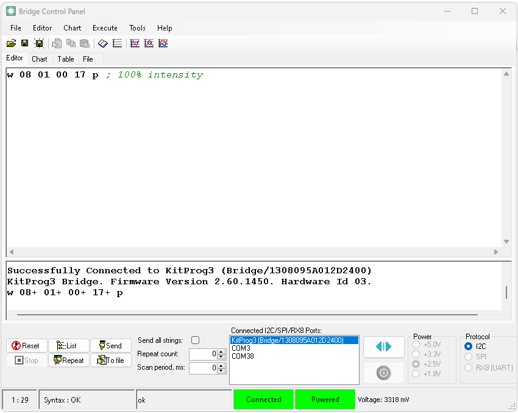
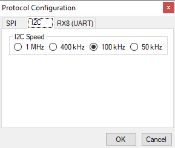
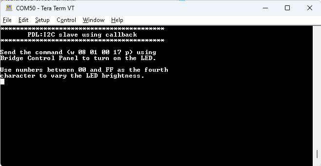

# PSOC&trade; Control MCU: I2C slave using callback

This code example demonstrates the operation of the I2C (PDL) resource in slave mode using callback. The I2C slave with callback is implemented in the code example and the I2C interface available on the onboard KitProg3 debugger bridge is used as the master. Bridge Control Panel software available for Windows PCs is used for communicating with the slave from the PC. With this code example, by sending commands from the Bridge Control Panel software, the intensity of an LED on the evaluation kit (EVK) can be controlled. Processing of the I2C data received from the master is done inside the slave callback.

[View this README on GitHub.](https://github.com/Infineon/mtb-example-ce240631-i2c-slave-callback)

[Provide feedback on this code example.](https://cypress.co1.qualtrics.com/jfe/form/SV_1NTns53sK2yiljn?Q_EED=eyJVbmlxdWUgRG9jIElkIjoiQ0UyNDA2MzEiLCJTcGVjIE51bWJlciI6IjAwMi00MDYzMSIsIkRvYyBUaXRsZSI6IlBTT0MmdHJhZGU7IENvbnRyb2wgTUNVOiBJMkMgc2xhdmUgdXNpbmcgY2FsbGJhY2siLCJyaWQiOiJrb296aGFtcGFyYW0iLCJEb2MgdmVyc2lvbiI6IjEuMC4wIiwiRG9jIExhbmd1YWdlIjoiRW5nbGlzaCIsIkRvYyBEaXZpc2lvbiI6Ik1DRCIsIkRvYyBCVSI6IklDVyIsIkRvYyBGYW1pbHkiOiJQU09DIn0=)


## Requirements

- [ModusToolbox&trade;](https://www.infineon.com/modustoolbox) v3.3 or later (tested with v3.3)
- Board support package (BSP) minimum required version: 1.0.3
- Programming language: C
- Associated parts: All [PSOC&trade; Control C3 MCUs](https://www.infineon.com/cms/en/product/microcontroller/32-bit-psoc-arm-cortex-microcontroller/32-bit-psoc-control-arm-cortex-m33-mcu/)


## Supported toolchains (make variable 'TOOLCHAIN')

- GNU Arm&reg; Embedded Compiler v11.3.1 (`GCC_ARM`) – Default value of `TOOLCHAIN`
- Arm&reg; Compiler v6.22 (`ARM`)
- IAR C/C++ Compiler v9.50.2 (`IAR`)


## Supported kits (make variable 'TARGET')

- [PSOC&trade; Control C3M5 Evaluation Kit](https://www.infineon.com/KIT_PSC3M5_EVK) (`KIT_PSC3M5_EVK`) – Default value of `TARGET`


## Hardware setup

This example uses the board's default configuration. See the kit user guide to ensure that the board is configured correctly.

1. MiniProg4 connection: Connect the USB cable provided along with the kit to the USB port of the evaluation kit (EVK).

   - **Program and debug interface:** Use the onboard debug interface through the connected USB cable.

   - **UART interface for serial COM port:** Use the UART connected to the onboard debug interface.

## Software setup

This code example uses the **Bridge Control Panel** (BCP) software to transmit and receive the data over I2C. The BCP software is installed automatically as part of the [PSOC&trade; Programmer](https://softwaretools.infineon.com/tools/com.ifx.tb.tool.psocprogrammer) installation.

> **Note:** **Bridge Control Panel** (BCP) is currently supported only on Windows.

Do the following to configure BCP:

1.  Open BCP from **Start** > **All apps** > **Infineon** > **Bridge Control Panel**.

2.  Select **KitProg3** under **Connected I2C/SPI/RX8 Ports** (see **Figure 1**). Note that the PSOC&trade; Control C3M5 Evaluation Kit must be connected to the USB port of your computer.

    **Figure 1. Bridge Control Panel**

    

3.  Select **Tools** > **Protocol Configuration**. Navigate to the **I2C** tab, and set the **I2C speed** to **100 kHz**. Click **OK**. BCP is now ready for transmitting and receiving data.

    **Figure 2. Protocol configuration**

    
    
Install a terminal emulator if you don't have one. Instructions in this document use [Tera Term](https://teratermproject.github.io/index-en.html).   

## Using the code example


### Create the project

The ModusToolbox&trade; tools package provides the Project Creator as both a GUI tool and a command line tool.

<details><summary><b>Use Project Creator GUI</b></summary>

1. Open the Project Creator GUI tool.

   There are several ways to do this, including launching it from the dashboard or from inside the Eclipse IDE. For more details, see the [Project Creator user guide](https://www.infineon.com/ModusToolboxProjectCreator) (locally available at *{ModusToolbox&trade; install directory}/tools_{version}/project-creator/docs/project-creator.pdf*).

2. On the **Choose Board Support Package (BSP)** page, select a kit supported by this code example. See [Supported kits](#supported-kits-make-variable-target).

   > **Note:** To use this code example for a kit not listed here, you may need to update the source files. If the kit does not have the required resources, the application may not work.

3. On the **Select Application** page:

   a. Select the **Applications(s) Root Path** and the **Target IDE**.

   > **Note:** Depending on how you open the Project Creator tool, these fields may be pre-selected for you.

   b. Select this code example from the list by enabling its check box.

   > **Note:** You can narrow the list of displayed examples by typing in the filter box.

   c. (Optional) Change the suggested **New Application Name** and **New BSP Name**.

   d. Click **Create** to complete the application creation process.

</details>

<details><summary><b>Use Project Creator CLI</b></summary>

The 'project-creator-cli' tool can be used to create applications from a CLI terminal or from within batch files or shell scripts. This tool is available in the *{ModusToolbox&trade; install directory}/tools_{version}/project-creator/* directory.

Use a CLI terminal to invoke the 'project-creator-cli' tool. On Windows, use the command-line 'modus-shell' program provided in the ModusToolbox&trade; installation instead of a standard Windows command-line application. This shell provides access to all ModusToolbox&trade; tools. You can access it by typing "modus-shell" in the search box in the Windows menu. In Linux and macOS, you can use any terminal application.

The following example clones the "[PSOC&trade; Control MCU: I2C slave using callback](https://github.com/Infineon/mtb-example-ce240631-i2c-slave-callback)" application with the desired name "I2cSlaveCallback" configured for the *KIT_PSC3M5_EVK* BSP into the specified working directory, *C:/mtb_projects*:

   ```
   project-creator-cli --board-id KIT_PSC3M5_EVK --app-id mtb-example-ce240631-i2c-slave-callback --user-app-name I2cSlaveCallback --target-dir "C:/mtb_projects"
   ```


The 'project-creator-cli' tool has the following arguments:

Argument | Description | Required/optional
---------|-------------|-----------
`--board-id` | Defined in the <id> field of the [BSP](https://github.com/Infineon?q=bsp-manifest&type=&language=&sort=) manifest | Required
`--app-id`   | Defined in the <id> field of the [CE](https://github.com/Infineon?q=ce-manifest&type=&language=&sort=) manifest | Required
`--target-dir`| Specify the directory in which the application is to be created if you prefer not to use the default current working directory | Optional
`--user-app-name`| Specify the name of the application if you prefer to have a name other than the example's default name | Optional

<br>

> **Note:** The project-creator-cli tool uses the `git clone` and `make getlibs` commands to fetch the repository and import the required libraries. For details, see the "Project creator tools" section of the [ModusToolbox&trade; tools package user guide](https://www.infineon.com/ModusToolboxUserGuide) (locally available at {ModusToolbox&trade; install directory}/docs_{version}/mtb_user_guide.pdf).

</details>


### Open the project

After the project has been created, you can open it in your preferred development environment.


<details><summary><b>Eclipse IDE</b></summary>

If you opened the Project Creator tool from the included Eclipse IDE, the project will open in Eclipse automatically.

For more details, see the [Eclipse IDE for ModusToolbox&trade; user guide](https://www.infineon.com/MTBEclipseIDEUserGuide) (locally available at *{ModusToolbox&trade; install directory}/docs_{version}/mt_ide_user_guide.pdf*).

</details>


<details><summary><b>Visual Studio (VS) Code</b></summary>

Launch VS Code manually, and then open the generated *{project-name}.code-workspace* file located in the project directory.

For more details, see the [Visual Studio Code for ModusToolbox&trade; user guide](https://www.infineon.com/MTBVSCodeUserGuide) (locally available at *{ModusToolbox&trade; install directory}/docs_{version}/mt_vscode_user_guide.pdf*).

</details>


<details><summary><b>Keil µVision</b></summary>

Double-click the generated *{project-name}.cprj* file to launch the Keil µVision IDE.

For more details, see the [Keil µVision for ModusToolbox&trade; user guide](https://www.infineon.com/MTBuVisionUserGuide) (locally available at *{ModusToolbox&trade; install directory}/docs_{version}/mt_uvision_user_guide.pdf*).

</details>


<details><summary><b>IAR Embedded Workbench</b></summary>

Open IAR Embedded Workbench manually, and create a new project. Then select the generated *{project-name}.ipcf* file located in the project directory.

For more details, see the [IAR Embedded Workbench for ModusToolbox&trade; user guide](https://www.infineon.com/MTBIARUserGuide) (locally available at *{ModusToolbox&trade; install directory}/docs_{version}/mt_iar_user_guide.pdf*).

</details>


<details><summary><b>Command line</b></summary>

If you prefer to use the CLI, open the appropriate terminal, and navigate to the project directory. On Windows, use the command-line 'modus-shell' program; on Linux and macOS, you can use any terminal application. From there, you can run various `make` commands.

For more details, see the [ModusToolbox&trade; tools package user guide](https://www.infineon.com/ModusToolboxUserGuide) (locally available at *{ModusToolbox&trade; install directory}/docs_{version}/mtb_user_guide.pdf*).

</details>


## Operation


The I2C resource of the MCU that is connected to the onboard debugger bridge is configured in slave mode and it accepts command packets to control the intensity of an LED. The I2C slave updates its read buffer with a status packet in response to the accepted command. The master reads this response packet.

In this example, Bridge Control Panel (BCP) software running on the host PC is used for controlling the I2C master on the onboard KitProg3 debugger bridge. LED control is implemented using a TCPWM resource (configured as PWM). The intensity of the LED is controlled by changing the duty cycle of the PWM signal.

1. Connect the board to your PC using the provided USB cable through the KitProg3 USB connector.

2. Open a terminal program and select the KitProg3 COM port. Set the serial port parameters to 8N1 and 115200 baud.

3. Program the board using one of the following:

   <details><summary><b>Using Eclipse IDE</b></summary>

      1. Select the application project in the Project Explorer.

      2. In the **Quick Panel**, scroll down, and click **\<Application Name> Program (KitProg3_MiniProg4)**.
   </details>


   <details><summary><b>In other IDEs</b></summary>

   Follow the instructions in your preferred IDE.
   </details>


   <details><summary><b>Using CLI</b></summary>

     From the terminal, execute the `make program` command to build and program the application using the default toolchain to the default target. The default toolchain is specified in the application's Makefile but you can override this value manually:
      ```
      make program TOOLCHAIN=<toolchain>
      ```

      Example:
      ```
      make program TOOLCHAIN=GCC_ARM
      ```
   </details>

    After programming, the application starts automatically.

3.  Configure the BCP software as described in the [Software setup](#software-setup) section.

4.  In the **Editor** tab of BCP, type the command to send the LED intensity data, and then click **Send**. Observe that the LED turns ON with the specified intensity.

      If BCP is used as the I2C master, the following command format is used to write the data to the slave. The symbol ‘SoP’ means ‘start of packet’ and ‘EoP’ means ‘end of packet’.

      **Table 1. I2C master command format**
    
      Start for write | Slave address | SoP  | LED TCPWM compare value | EoP  | Stop
      -----------------|---------------|------|-------------------------|------|------
      w               | 0x08          | 0x01 | 0x00 to 0xFF            | 0x17 | p    

      <br>
     
      For example, 
      - Sending the `w 08 01 00 17 p` command will turn ON the LED with full intensity.
      - Sending the `w 08 01 FF 17 p` command will turn OFF the LED.

5.  Type the `r 08 x x x p` command to read the status of the write performed.

      The following command format is used to read the status form the slave’s read buffer. The symbol ‘x’ denotes one byte to read from the slave’s read buffer. In this example, 3 bytes are read from the slave.
    
      **Table 2. Slave read buffer command**
    
      Start for read | Slave address | SoP | LED TCPWM compare value | EoP | Stop 
      ----------------|---------------|-----|-------------------------|-----|------
      r              | 0x08          | x   | x                       | x   | p    
     
      <br>

      Before reading the status packet from the read buffer of the slave by sending the `r 08 x x x p` command, a write command must be executed each time. For the command sent by the I2C master:
      - If the packet read is in the format `r 08 01 00 17 p`, the status is set as 'success'.
      - If the packet read is `r 08 01 FF 17 p`, the status is set as 'fail'.
    
      See **Figure 1** in the [Software setup](#software-setup) section for more information.
    
> **Note:** BCP will not be able to use while debugging.

    
When the code started to run, it will display the information shown in **Figure 3** on the debug UART console.
    
   **Figure 3. Terminal output on program startup** 

   

## Debugging

You can debug the example to step through the code.


<details><summary><b>In Eclipse IDE</b></summary>

Use the **\<Application Name> Debug (KitProg3_MiniProg4)** configuration in the **Quick Panel**. For details, see the "Program and debug" section in the [Eclipse IDE for ModusToolbox&trade; user guide](https://www.infineon.com/MTBEclipseIDEUserGuide).

</details>


<details><summary><b>In other IDEs</b></summary>

Follow the instructions in your preferred IDE.

</details>


## Design and implementation

This example demonstrates the operation of an I2C resource for PSOC&trade; Control C3 MCU in slave mode using callback. The I2C slave is configured with a 3-byte write buffer, which can be accessed by the I2C master to write commands. In addition, a 3-byte read buffer is configured to read the status of the slave by the master.

To control the intensity of the LED, a PWM with a period value of 255 microseconds is used. The duty cycle of the PWM is controlled by the firmware using the data sent by the I2C master.

The first byte in the write buffer contains the Start of Packet (SoP) value, the next byte contains the compare value for the TCPWM controlling the LED, and the third byte in the write buffer is the End of Packet (EoP) value. The slave updates the master’s read buffer with the status packet. The first byte of the status packet is SoP, the second byte contains the status where the value 0x00 means success and 0xFF means failure for the command data sent by the master, and the third byte in the read buffer is EoP.

In the callback function, data write and read complete events from the master are handled through interrupts. Device configurator and I2C PDL APIs are used to configure the resource to act as an I2C slave, and to configure its relevant interrupts to handle data write and read complete events by the master.


### Resources and settings

**Table 3. Application resources**

 Resource          |  Alias/object     |    Purpose
 :---------------- | :---------------- | :-------------------
 I2C               | CALLBACK_I2C      | I2C slave            
 TCPWM (PWM)       | LED_PWM           | PWM to drive user LED
 GPIO              | CYBSP_USER_LED    | User LED to show visual output
 UART              | DEBUG_UART        | UART used by Retarget-IO 

<br>


## Related resources

Resources  | Links
-----------|----------------------------------
Application notes  | [AN238329](https://www.infineon.com/cms/en/product/microcontroller/32-bit-psoc-arm-cortex-microcontroller/32-bit-psoc-control-arm-cortex-m33-mcu/psoc-control-c3p/#!documents) – Getting started with PSOC&trade; Control C3 MCU on ModusToolbox&trade; software
Code examples  | [Using ModusToolbox&trade;](https://github.com/Infineon/Code-Examples-for-ModusToolbox-Software) on GitHub
Device documentation | [PSOC&trade; Control C3 MCU datasheet](https://www.infineon.com/cms/en/product/microcontroller/32-bit-psoc-arm-cortex-microcontroller/32-bit-psoc-control-arm-cortex-m33-mcu/psoc-control-c3p/#!documents) <br> [PSOC&trade; Control C3 technical reference manuals](https://www.infineon.com/cms/en/product/microcontroller/32-bit-psoc-arm-cortex-microcontroller/32-bit-psoc-control-arm-cortex-m33-mcu/psoc-control-c3p/#!documents)
Development kits | Select your kits from the [Evaluation board finder](https://www.infineon.com/cms/en/design-support/finder-selection-tools/product-finder/evaluation-board).
Libraries on GitHub  | [mtb-pdl-cat1](https://github.com/Infineon/mtb-pdl-cat1) – Peripheral Driver Library (PDL) <br> [mtb-hal-psc3](https://github.com/Infineon/mtb-hal-psc3) – Hardware Abstraction Layer (HAL) library <br> [retarget-io](https://github.com/Infineon/retarget-io) – Utility library to retarget STDIO messages to a UART port
Tools  | [ModusToolbox&trade;](https://www.infineon.com/modustoolbox) – ModusToolbox&trade; software is a collection of easy-to-use libraries and tools enabling rapid development with Infineon MCUs for applications ranging from wireless and cloud-connected systems, edge AI/ML, embedded sense and control, to wired USB connectivity using PSOC&trade; Industrial/IoT MCUs, AIROC&trade; Wi-Fi and Bluetooth&reg; connectivity devices, XMC&trade; Industrial MCUs, and EZ-USB&trade;/EZ-PD&trade; wired connectivity controllers. ModusToolbox&trade; incorporates a comprehensive set of BSPs, HAL, libraries, configuration tools, and provides support for industry-standard IDEs to fast-track your embedded application development.

<br>


## Other resources

Infineon provides a wealth of data at [www.infineon.com](https://www.infineon.com) to help you select the right device, and quickly and effectively integrate it into your design.


## Document history

Document title: *CE240631* – *PSOC&trade; Control MCU: I2C slave using callback*

 Version | Description of change
 ------- | ---------------------
 1.0.0   | New code example

<br>


All referenced product or service names and trademarks are the property of their respective owners.

The Bluetooth&reg; word mark and logos are registered trademarks owned by Bluetooth SIG, Inc., and any use of such marks by Infineon is under license.


---------------------------------------------------------

© Cypress Semiconductor Corporation, 2024. This document is the property of Cypress Semiconductor Corporation, an Infineon Technologies company, and its affiliates ("Cypress").  This document, including any software or firmware included or referenced in this document ("Software"), is owned by Cypress under the intellectual property laws and treaties of the United States and other countries worldwide.  Cypress reserves all rights under such laws and treaties and does not, except as specifically stated in this paragraph, grant any license under its patents, copyrights, trademarks, or other intellectual property rights.  If the Software is not accompanied by a license agreement and you do not otherwise have a written agreement with Cypress governing the use of the Software, then Cypress hereby grants you a personal, non-exclusive, nontransferable license (without the right to sublicense) (1) under its copyright rights in the Software (a) for Software provided in source code form, to modify and reproduce the Software solely for use with Cypress hardware products, only internally within your organization, and (b) to distribute the Software in binary code form externally to end users (either directly or indirectly through resellers and distributors), solely for use on Cypress hardware product units, and (2) under those claims of Cypress's patents that are infringed by the Software (as provided by Cypress, unmodified) to make, use, distribute, and import the Software solely for use with Cypress hardware products.  Any other use, reproduction, modification, translation, or compilation of the Software is prohibited.
<br>
TO THE EXTENT PERMITTED BY APPLICABLE LAW, CYPRESS MAKES NO WARRANTY OF ANY KIND, EXPRESS OR IMPLIED, WITH REGARD TO THIS DOCUMENT OR ANY SOFTWARE OR ACCOMPANYING HARDWARE, INCLUDING, BUT NOT LIMITED TO, THE IMPLIED WARRANTIES OF MERCHANTABILITY AND FITNESS FOR A PARTICULAR PURPOSE.  No computing device can be absolutely secure.  Therefore, despite security measures implemented in Cypress hardware or software products, Cypress shall have no liability arising out of any security breach, such as unauthorized access to or use of a Cypress product. CYPRESS DOES NOT REPRESENT, WARRANT, OR GUARANTEE THAT CYPRESS PRODUCTS, OR SYSTEMS CREATED USING CYPRESS PRODUCTS, WILL BE FREE FROM CORRUPTION, ATTACK, VIRUSES, INTERFERENCE, HACKING, DATA LOSS OR THEFT, OR OTHER SECURITY INTRUSION (collectively, "Security Breach").  Cypress disclaims any liability relating to any Security Breach, and you shall and hereby do release Cypress from any claim, damage, or other liability arising from any Security Breach.  In addition, the products described in these materials may contain design defects or errors known as errata which may cause the product to deviate from published specifications. To the extent permitted by applicable law, Cypress reserves the right to make changes to this document without further notice. Cypress does not assume any liability arising out of the application or use of any product or circuit described in this document. Any information provided in this document, including any sample design information or programming code, is provided only for reference purposes.  It is the responsibility of the user of this document to properly design, program, and test the functionality and safety of any application made of this information and any resulting product.  "High-Risk Device" means any device or system whose failure could cause personal injury, death, or property damage.  Examples of High-Risk Devices are weapons, nuclear installations, surgical implants, and other medical devices.  "Critical Component" means any component of a High-Risk Device whose failure to perform can be reasonably expected to cause, directly or indirectly, the failure of the High-Risk Device, or to affect its safety or effectiveness.  Cypress is not liable, in whole or in part, and you shall and hereby do release Cypress from any claim, damage, or other liability arising from any use of a Cypress product as a Critical Component in a High-Risk Device. You shall indemnify and hold Cypress, including its affiliates, and its directors, officers, employees, agents, distributors, and assigns harmless from and against all claims, costs, damages, and expenses, arising out of any claim, including claims for product liability, personal injury or death, or property damage arising from any use of a Cypress product as a Critical Component in a High-Risk Device. Cypress products are not intended or authorized for use as a Critical Component in any High-Risk Device except to the limited extent that (i) Cypress's published data sheet for the product explicitly states Cypress has qualified the product for use in a specific High-Risk Device, or (ii) Cypress has given you advance written authorization to use the product as a Critical Component in the specific High-Risk Device and you have signed a separate indemnification agreement.
<br>
Cypress, the Cypress logo, and combinations thereof, ModusToolbox, PSoC, CAPSENSE, EZ-USB, F-RAM, and TRAVEO are trademarks or registered trademarks of Cypress or a subsidiary of Cypress in the United States or in other countries. For a more complete list of Cypress trademarks, visit www.infineon.com. Other names and brands may be claimed as property of their respective owners.
